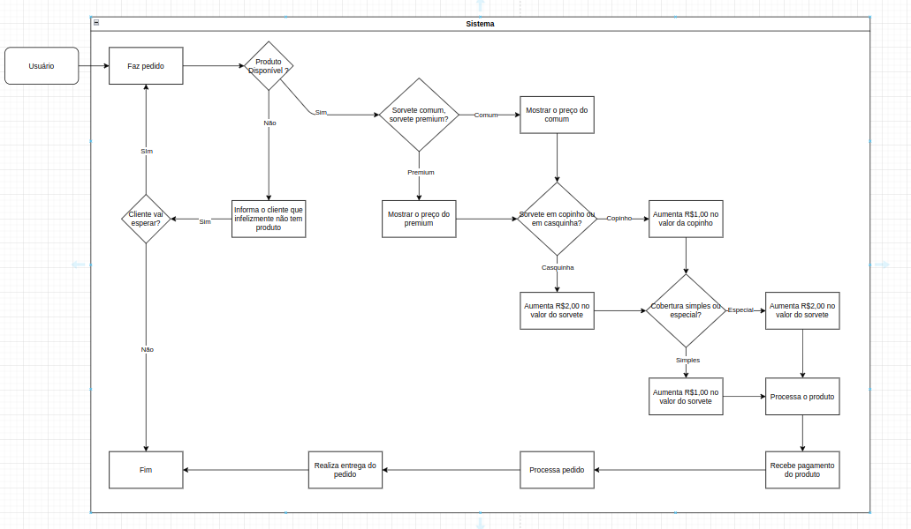

# 🍦 Sorveteria em Python

Este é um projeto simples de terminal que simula uma sorveteria utilizando **Python** com foco no uso de **Programação Orientada a Objetos (POO)**. O objetivo é reforçar conceitos como herança, encapsulamento e uso de propriedades (`@property`).

---

## 🧠 O que foi trabalhado

- **POO (Programação Orientada a Objetos)**:
  - Criação de classes como `Sorvete`, `SorveteComum`, `SorvetePremium` e `Sorveteria`
  - Uso de herança para estender comportamentos
  - Propriedades com `@property` e `@setter`
  - Encapsulamento de atributos (como `_preco`, `_suporte` e `_cobertura`)

- **Interação com o usuário via terminal**:
  - Simulação de um pedido de sorvete
  - Escolha de tipo (`comum` ou `premium`)
  - Escolha de suporte (`casquinha` ou `copinho`)
  - Escolha de cobertura (`simples` ou `especial`)
  - Cálculo do preço total

- **Estética textual**:
  - Texto animado com efeito de digitação (`utils.delay_texto.digitar`)

---

## 🚀 Como executar

1. Clone este repositório:
   ```bash
   git clone https://github.com/seu-usuario/sorveteria-poo.git
   cd sorveteria-poo

2. Execute o script principal:
   ```bash
   python src/main.py


---

## 📐 Diagrama da Sorveteria

Para entender melhor a estrutura do projeto, temos o arquivo de diagrama `sorveteria.drawio`, que mostra o fluxo e a relação entre as classes.

> **Importante:** O GitHub não exibe diretamente arquivos `.drawio`. Para visualizar, faça o download do arquivo e abra no [draw.io](https://app.diagrams.net/) ou em outro editor compatível.

### Visualização do Diagrama

Para facilitar a visualização, incluímos a imagem exportada do diagrama abaixo:



> Caso queira atualizar o diagrama, edite o `sorveteria.drawio` e gere uma nova imagem para substituir esta.

---
